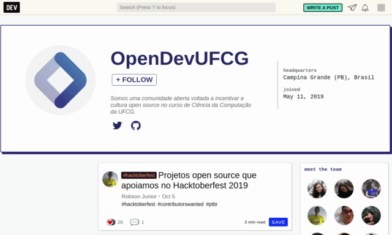

    
    <h1>
        <a href="https://dev.to/OpenDevUFCG" target="_self">
            
            OpenDevUFCGBlog
        </a>
    </h1>
    <strong>Tem algum conteúdo que você quer compartilhar com a comunidade? Fala com o OpenDevUFCG que a gente te impulsiona </strong>
     
    

## Publicações
|                                |Autor                          |Data                         | 
|--------------------------------|:-----------------------------:|:---------------------------:|
|[Projetos open source que apoiamos no Hacktoberfest 2019](https://dev.to/opendevufcg/projetos-open-source-que-apoiamos-no-hacktoberfest-2019-34be) |[Robson Junior](https://dev.to/jrobsonjr) | 5 de Outubro de 2019 |
|[Cloud e OpenStack: Uma breve introdução](https://dev.to/opendevufcg/cloud-e-openstack-uma-breve-introducao-49cb) |[Marta Laís](https://dev.to/martalais) | 21 de Setembro de 2019 |
|[Usando o spotify-web-sdk para gerenciar requisições à API Web do Spotify](https://dev.to/opendevufcg/usando-o-spotify-web-sdk-para-gerenciar-requisicoes-a-api-web-do-spotify-3j3i) |[Robson Junior](https://dev.to/jrobsonjr) | 15 de Setembro de 2019 |
|[Testes em JavaScript: Conceitos iniciais](https://dev.to/opendevufcg/testes-em-javascript-conceitos-iniciais-1okj) |[Júlio Guedes](https://dev.to/juliobguedes) | 7 de Setembro de 2019 |
|[Usando Scrapy para obter metadados das músicas dos Parcels através do Genius](https://dev.to/opendevufcg/usando-scrapy-para-obter-metadados-das-musicas-dos-parcels-atraves-do-genius-1dhj) |[Fanny](https://dev.to/fannyvieira) | 31 de Agosto de 2019 |
|[Administrando Sistemas com Docker](https://dev.to/opendevufcg/administrando-sistemas-com-docker-4pgm) |[Victor Hugo](https://dev.to/victorhundo) | 24 de Agosto de 2019 |
|[Criando malhas simples com CSS Grid](https://dev.to/opendevufcg/criando-malhas-simples-com-css-grid-3kd2) |[Pedro Espíndula](https://dev.to/pedroespindula) | 17 de Agosto de 2019 |
|[Introdução à Ciência de Dados](https://dev.to/opendevufcg/introducao-a-ciencia-de-dados-n4c) | [Hadrizia Santos](https://dev.to/hadrizia) | 10 de Agosto de 2019 |
|[Contribuindo para projetos open source com GitHub](https://dev.to/opendevufcg/contribuindo-para-projetos-open-source-com-github-3i76) |[Lucas de Medeiros](https://dev.to/lukehxh) | 3 de Agosto de 2019|

## Como contribuir
Quer contribuir? Veja como no [`CONTRIBUTING.md`](https://github.com/OpenDevUFCG/OpenDevUFCGBlog/blob/master/CONTRIBUTING.md).
